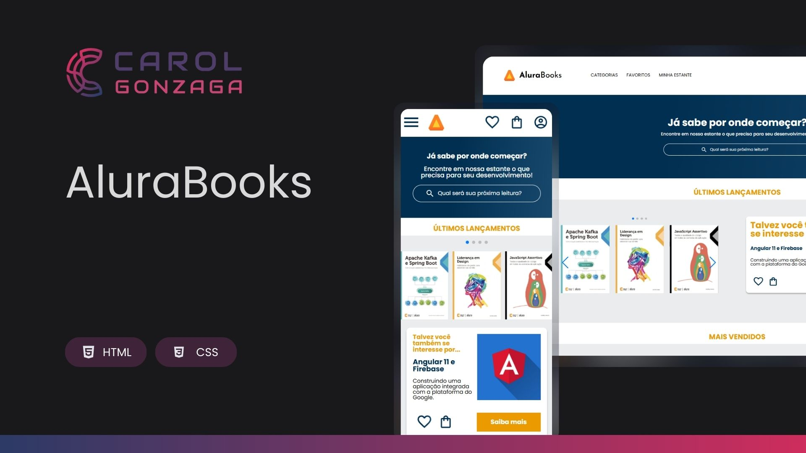

  

 

Uma aplicação responsiva de livraria digital, desenvolvida durante o curso de responsividade da Alura. O projeto simula uma vitrine online com carrossel de livros, áreas de destaque e tópicos em alta.

  <a href="#-tecnologias">Tecnologias</a>&nbsp;&nbsp;&nbsp;|&nbsp;&nbsp;&nbsp;
  <a href="#-objetivo">Objetivo</a>&nbsp;&nbsp;&nbsp;|&nbsp;&nbsp;&nbsp;
  <a href="#-funcionalidades">Funcionalidades</a>&nbsp;&nbsp;&nbsp;|&nbsp;&nbsp;&nbsp;
  <a href="https://carolgonzaga.github.io/alurabook/" target="_blank">Acesse o Projeto</a>

 
 

  

 
 

## 🚀 Tecnologias

Esse projeto foi desenvolvido com as seguintes tecnologias:

-   HTML5
-   CSS3 (com abordagem mobile-first e responsividade)
-   SwiperJS (carrossel interativo)

 
 

## 🎯 Objetivo

O objetivo deste projeto é praticar conceitos fundamentais de **responsividade e design adaptativo**, aplicando:

-   Estruturação semântica em HTML5
-   CSS responsivo com media queries
-   Criação de componentes reutilizáveis (banner, carrossel, tópicos, rodapé)
-   Design mobile-first
-   Integração de biblioteca externa para carrossel (SwiperJS)

 
 

## 🛠️ Funcionalidades

A aplicação permite ao usuário:

-   Ter uma experiência visual adaptada para **celulares, tablets e desktops**

